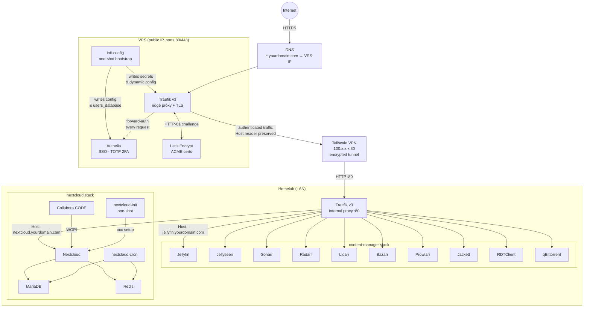

# server-environments

Infrastructure-as-code for a two-tier self-hosted setup: a **homelab** running on a local machine and a **VPS** acting as a hardened public gateway that tunnels traffic to the homelab over Tailscale.

---

## Architecture overview



---

## How the dual-proxy routing works

This is the most important concept to understand before deploying. There are **two Traefik instances** in the chain, and they cooperate through a single mechanism: the `Host` header.

### The full request path

```
Browser  →  VPS Traefik  →  Authelia  →  Tailscale  →  Homelab Traefik  →  Container
```

**Step 1 — VPS Traefik receives the request**

A browser opens `https://jellyfin.yourdomain.com`. The VPS Traefik matches this against its **dynamic file provider** config (`homelab.yml`, written by `init-config`):

```yaml
# vps: traefik dynamic config (homelab.yml)
routers:
  homelab-jellyfin:
    rule: "Host(`jellyfin.yourdomain.com`)"
    entrypoints: [websecure]
    service: homelab
    tls:
      certResolver: le
```

**Step 2 — Forward-auth check**

Before forwarding, Traefik calls Authelia via the `forwardAuth` middleware. Authelia checks whether the browser has a valid session cookie. If not, it redirects to `https://auth.yourdomain.com` for login + TOTP. If yes, it returns HTTP 200 and the request continues.

**Step 3 — VPS Traefik forwards to the homelab**

The matched service backend is:

```yaml
services:
  homelab:
    loadBalancer:
      passHostHeader: true          # <── critical setting
      servers:
        - url: "http://100.x.x.x:80"
```

`passHostHeader: true` means the original `Host: jellyfin.yourdomain.com` header is **not replaced** with the backend IP. The request arrives at homelab Traefik on port 80 still carrying the original hostname.

**Step 4 — Homelab Traefik routes by the same Host header**

The homelab Traefik has a router (declared via Docker labels on the Jellyfin container) that matches the hostname. To allow both public access (traffic forwarded by the VPS carrying `jellyfin.yourdomain.com`) and direct LAN access (using a local domain like `jellyfin.home.arpa`), use the `||` operator to match either host:

```yaml
# content-manager.yml label on the jellyfin service
traefik.http.routers.jellyfin.rule=Host(`jellyfin.${LOCAL_DOMAIN}`) || Host(`jellyfin.yourdomain.com`)
```

This way the homelab Traefik accepts requests from both paths: the public hostname forwarded through the VPS tunnel, and the local hostname used for direct LAN access. `LOCAL_DOMAIN` can be set to your internal domain (e.g. `home.arpa`) independently of the public domain.

**Step 5 — Response travels back the same chain**

The response flows back: Jellyfin → homelab Traefik → Tailscale tunnel → VPS Traefik → browser. TLS is terminated at the VPS Traefik only; all internal hops are plain HTTP.

### Why the homelab router rule must match the forwarded Host header

The homelab Traefik is completely unaware of the VPS. It simply sees an incoming HTTP request with a `Host` header and matches it against its own routing rules. If the router rule only covers `jellyfin.home.arpa` but the VPS forwards traffic with `Host: jellyfin.yourdomain.com`, homelab Traefik would return a 404.

The solution is to use the `||` operator in the Traefik label to match **both** the local hostname and the public hostname:

```yaml
# in content-manager.yml, on the jellyfin service
traefik.http.routers.jellyfin.rule=Host(`jellyfin.${LOCAL_DOMAIN}`) || Host(`jellyfin.yourdomain.com`)
```

This means:
- **Local access** (`jellyfin.home.arpa`) hits homelab Traefik directly and matches the first condition.
- **Public access** (`jellyfin.yourdomain.com`) arrives through the VPS tunnel and matches the second condition.

`LOCAL_DOMAIN` can be any internal domain (e.g. `home.arpa`) — it no longer needs to equal the public domain. The public hostname is hardcoded in the second `Host()` condition of the rule.

Services that are **LAN-only** (Sonarr, Radarr, Prowlarr, etc.) have no VPS router defined, so they remain unreachable from the internet regardless — the VPS Traefik simply has no matching rule for `sonarr.yourdomain.com`.

### Provider separation: Docker vs File

The VPS Traefik uses **two providers simultaneously**:

| Provider | Purpose |
|---|---|
| `docker` | Routes for containerised services on the VPS (Authelia, Traefik dashboard). Labels on containers define the rules. |
| `file` (dynamic dir) | Routes for homelab services. Written by `init-config` into the `traefik_dynamic` volume at first boot, hot-reloaded via `watch=true`. |

This separation is necessary because the homelab containers are not visible to the VPS Docker socket. The file provider acts as a static bridge config pointing at the Tailscale IP.

---

## Prerequisites

### 1. A public domain

Every service is routed by hostname. You need a domain where you control DNS.

- Point a **wildcard A record** `*.yourdomain.com` at the VPS public IP.
- Traefik will automatically obtain a TLS certificate for each subdomain via Let's Encrypt HTTP-01 challenge.
- In the homelab Traefik labels, use the `||` operator to accept both the local hostname and the public hostname: `Host(`service.${LOCAL_DOMAIN}`) || Host(`service.yourdomain.com`)`. This allows direct LAN access via `LOCAL_DOMAIN` and public access via the VPS without coupling the two domains.

Subdomains in use:

| Subdomain | Access | Service |
|---|---|---|
| `auth.yourdomain.com` | Public (Authelia portal) | Authelia |
| `traefik.yourdomain.com` | VPS — admins only | Traefik dashboard |
| `jellyfin.yourdomain.com` | VPS + LAN | Jellyfin |
| `nextcloud.yourdomain.com` | VPS + LAN | Nextcloud |
| `requests.yourdomain.com` | LAN only | Jellyseerr |
| `sonarr.yourdomain.com` | LAN only | Sonarr |
| `radarr.yourdomain.com` | LAN only | Radarr |
| `lidarr.yourdomain.com` | LAN only | Lidarr |
| `bazarr.yourdomain.com` | LAN only | Bazarr |
| `prowlarr.yourdomain.com` | LAN only | Prowlarr |
| `jackett.yourdomain.com` | LAN only | Jackett |
| `debrid.yourdomain.com` | LAN only | RDTClient |
| `qbittorrent.yourdomain.com` | LAN only | qBittorrent |
| `office.nextcloud.yourdomain.com` | LAN only | Collabora CODE |

### 2. Tailscale

Tailscale is the **only network path** from the VPS to the homelab. No homelab port is exposed to the internet directly.

- Install Tailscale on both the **VPS** and the **homelab machine**.
- Both machines must be authenticated to the same Tailscale tailnet and connected.
- Note the homelab's Tailscale IP (`100.x.x.x`) — this goes into `HOMELAB_TAILSCALE_IP` in the VPS env file.
- Tailscale runs as a host-level daemon; no containerisation is needed. The VPS containers reach the Tailscale IP through the host network.

To verify connectivity before deploying:

```bash
# on the VPS
curl http://<HOMELAB_TAILSCALE_IP>:80
```

You should get a response (even a 404) from the homelab Traefik. If this times out, Tailscale is not connected.

### 3. A NAS or persistent storage mount (homelab)

All media and Nextcloud data lives under `NAS_BASE` (default `/srv/nas_media`). This path must exist and be mounted before starting any homelab stack.

Expected structure:

```
$NAS_BASE/
├── media/
│   ├── movies/       # Radarr output → Jellyfin
│   ├── tv/           # Sonarr output → Jellyfin
│   └── anime/        # Jellyfin
├── downloads/        # qBittorrent landing dir → *arr import
├── nextcloud/        # Nextcloud data directory
└── config/           # qBittorrent config
```

### 4. Docker external network (homelab only)

All homelab stacks share an external Docker network called `proxy`. Create it once:

```bash
docker network create proxy
```

### 5. External Docker volume for Nextcloud DB (homelab only)

```bash
docker volume create nextcloud_nextcloud_db
```

### 6. Portainer (optional, recommended)

Portainer is not required, but it is strongly recommended for managing your homelab stacks. It gives you a web UI to start/stop/restart containers, inspect logs, browse volumes, and deploy new Compose stacks — all without SSHing into the machine.

Deploy it on the homelab once the `proxy` network exists:

```bash
docker volume create portainer_data

docker run -d \
  --name portainer \
  --restart unless-stopped \
  -v /var/run/docker.sock:/var/run/docker.sock \
  -v portainer_data:/data \
  --network proxy \
  --label "traefik.enable=true" \
  --label "traefik.http.routers.portainer.rule=Host(\`portainer.${LOCAL_DOMAIN}\`)" \
  --label "traefik.http.routers.portainer.entrypoints=web" \
  --label "traefik.http.services.portainer.loadbalancer.server.port=9000" \
  portainer/portainer-ce:latest
```

Portainer is intentionally kept **LAN-only** — there is no VPS router for it, so it is never reachable from the internet. Access it at `http://portainer.yourlocaldomian` from within the LAN. Portainer ships with its own authentication, so no additional auth layer is needed.

---

## Repository layout

```
server-environments/
├── homelab/
│   ├── reverse-proxy.yml       # Traefik v3 (HTTP :80, LAN only)
│   ├── content-manager.yml     # *arr media stack + Jellyfin
│   ├── content-manager.env     # Env vars for media stack
│   ├── nextcloud.yml           # Nextcloud + MariaDB + Redis + Collabora
│   └── nextcloud.env           # Env vars for Nextcloud stack
└── vps/
    ├── reverse-proxy.yml       # Traefik v3 + Authelia + init-config
    └── example.env             # Env var template — copy to .env and fill in
```

---

## Deployment

### Order matters

```
VPS stack → homelab reverse-proxy → homelab media stack → homelab nextcloud stack
```

The VPS must be up first so DNS challenges resolve. The homelab reverse proxy must be up before the other homelab stacks join the `proxy` network.

### 1. VPS

```bash
cd vps/
cp example.env .env
# Fill in all values — see env reference below
docker compose -f reverse-proxy.yml --env-file .env up -d
```

On first boot, `init-config` runs once and writes:
- Authelia secret files into the `authelia_config` volume
- Authelia `configuration.yml` and hashed `users_database.yml`
- Traefik dynamic config (`homelab.yml`) with routers for Jellyfin and Nextcloud

Subsequent restarts detect existing files and skip all writes (idempotent).

### 2. Homelab — reverse proxy

```bash
docker network create proxy   # once only

cd homelab/
docker compose -f reverse-proxy.yml up -d
```

### 3. Homelab — media stack

```bash
cd homelab/
# Edit content-manager.env: set TZ, LOCAL_DOMAIN (your internal domain, e.g. home.arpa), NAS_BASE
docker compose -f content-manager.yml --env-file content-manager.env up -d
```

### 4. Homelab — Nextcloud

```bash
docker volume create nextcloud_nextcloud_db   # once only

cd homelab/
# Edit nextcloud.env: set all passwords, NEXTCLOUD_HOST (= nextcloud.yourdomain.com)
docker compose -f nextcloud.yml --env-file nextcloud.env up -d
```

On first start, `nextcloud-init` waits for Nextcloud installation, then idempotently configures settings, installs Calendar and Contacts apps, and repairs the database.

---

## Environment variable reference

### `vps/.env`

| Variable | Description |
|---|---|
| `DOMAIN` | Public base domain, e.g. `example.com` |
| `HOMELAB_TAILSCALE_IP` | Tailscale IP of the homelab, e.g. `100.64.0.1` |
| `ACME_EMAIL` | Email for Let's Encrypt notifications |
| `TZ` | Timezone, e.g. `Europe/Madrid` |
| `AUTHELIA_USERNAME` | SSO login username |
| `AUTHELIA_USER_PASSWORD` | Plaintext password — hashed by `init-config` at first boot, not stored in plain text afterward |
| `AUTHELIA_USER_EMAIL` | User email |
| `AUTHELIA_USER_DISPLAYNAME` | Display name in the Authelia portal |
| `AUTHELIA_JWT_SECRET` | `openssl rand -hex 32` |
| `AUTHELIA_SESSION_SECRET` | `openssl rand -hex 32` |
| `AUTHELIA_STORAGE_KEY` | `openssl rand -hex 32` |

### `homelab/content-manager.env`

| Variable | Description |
|---|---|
| `TZ` | Timezone, e.g. `Europe/Madrid` |
| `PUID` | Host UID for LinuxServer containers (default `1000`) |
| `PGID` | Host GID for LinuxServer containers (default `1000`) |
| `UMASK` | File creation mask (default `002`) |
| `LOCAL_DOMAIN` | Internal/local domain used for direct LAN access, e.g. `home.arpa`. The homelab Traefik labels use `Host(\`service.${LOCAL_DOMAIN}\`) \|\| Host(\`service.yourdomain.com\`)` to also accept traffic forwarded by the VPS. |
| `NAS_BASE` | Absolute path to NAS mount (default `/srv/nas_media`) |

### `homelab/nextcloud.env`

| Variable | Description |
|---|---|
| `MYSQL_DATABASE` | MariaDB database name (default `nextcloud`) |
| `MYSQL_USER` | MariaDB user (default `nextcloud`) |
| `MYSQL_PASSWORD` | MariaDB password — **must be set** |
| `MYSQL_ROOT_PASSWORD` | MariaDB root password — **must be set** |
| `REDIS_PASSWORD` | Redis auth password — **must be set** |
| `NEXTCLOUD_ADMIN_USER` | Initial Nextcloud admin username |
| `NEXTCLOUD_ADMIN_PASSWORD` | Initial Nextcloud admin password — **must be set** |
| `NEXTCLOUD_HOST` | Full public hostname, e.g. `nextcloud.example.com` |
| `NEXTCLOUD_PROTOCOL` | `https` (traffic arrives from VPS already authenticated) |
| `DEFAULT_PHONE_REGION` | ISO 3166-1 code (default `ES`) |
| `COLLABORA_PASSWORD` | Collabora admin password — **must be set** |
| `TRAEFIK_NETWORK` | Docker network name (default `proxy`) |
| `TRAEFIK_ENTRYPOINT` | Traefik entrypoint (default `web`) |
| `NEXTCLOUD_VERSION` | Nextcloud image version to pin (default `33.0`) |
| `NAS_BASE` | Absolute path to NAS mount (default `/srv/nas_media`) |

---

## Access control (VPS)

Authelia is a safety net for services that have **no authentication of their own**. Services like Jellyfin and Nextcloud ship with their own login system and do not need Authelia in front of them — adding it only creates an unnecessary extra prompt.

| Service type | Authelia middleware? | Reason |
|---|---|---|
| Services **without built-in auth** (e.g. Traefik dashboard, *arr apps, qBittorrent, RDTClient) | **Yes** | Without it the service is fully open to the internet. |
| Services **with their own auth** (Jellyfin, Nextcloud, Portainer) | **No** | These services enforce their own login; Authelia adds no security benefit here. |

For Jellyfin and Nextcloud, omit the `middlewares` key entirely in their VPS router entries in `homelab.yml`:

```yaml
# vps: traefik dynamic config (homelab.yml)
routers:
  homelab-jellyfin:
    rule: "Host(`jellyfin.yourdomain.com`)"
    entrypoints: [websecure]
    service: homelab
    # no middlewares — Jellyfin handles auth itself
    tls:
      certResolver: le
```

The default Authelia access-control policy as written by `init-config`:

| Domain pattern | Policy | Group required |
|---|---|---|
| `auth.yourdomain.com` | Bypass | — (the login portal itself) |
| `traefik.yourdomain.com` | 2FA | `admins` |
| `*.yourdomain.com` | 2FA | `users` |

The user created by `init-config` belongs to both `admins` and `users`. On first login to any protected service, Authelia prompts TOTP enrolment (use Aegis, Authy, or any RFC 6238 app).

Sessions last **12 hours** with a **45-minute inactivity timeout**. The session cookie is scoped to the root domain, so a single login covers all subdomains.
